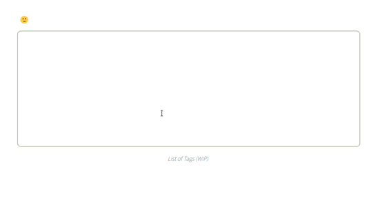

## Aventuras com contentEditable
*Um exemplo de uso da Selection e Range API*





#### Notas
Testado no Firefox e Chrome 


#### Abaixo as instruções default para instalação e execução

### Project setup 
```
npm install
```

#### Compiles and hot-reloads for development
```
npm run serve
```

